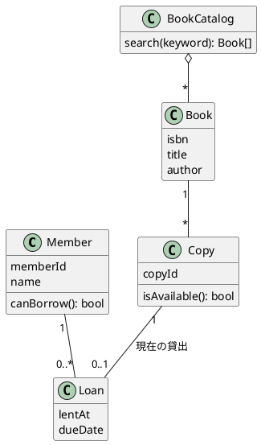

# ドメインモデル

ロバストネス分析・シーケンス図で見つかった名詞と操作をここへ反映し続けます。

```plantuml
@startuml
hide empty members
skinparam shadowing false

class Member {
  memberId
  name
  canBorrow(): bool
}
class Book {
  isbn
  title
  author
}
class Copy {
  copyId
  isAvailable(): bool
}
class Loan {
  lentAt
  dueDate
}
class BookCatalog {
  search(keyword): Book[]
}

Book "1" -- "*" Copy
Member "1" -- "0..*" Loan
Copy "1" -- "0..1" Loan : 現在の貸出
BookCatalog o-- "*" Book
@enduml
```
