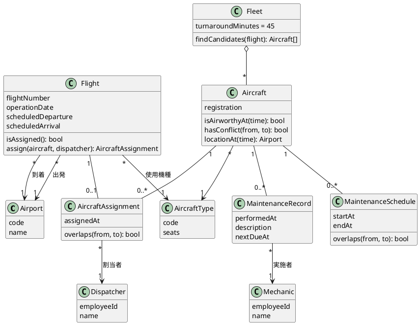

# ドメインモデル

ロバストネス分析・シーケンス図で見つかった名詞と操作をここへ反映し続けます。
操作は UC-002 のシーケンス図で割り当てたものです。

```plantuml
@startuml
hide empty members
skinparam shadowing false

class Airport {
  code
  name
}
class AircraftType {
  code
  seats
}
class Aircraft {
  registration
  isAirworthyAt(time): bool
  hasConflict(from, to): bool
  locationAt(time): Airport
}
class Fleet {
  turnaroundMinutes = 45
  findCandidates(flight): Aircraft[]
}
class Flight {
  flightNumber
  operationDate
  scheduledDeparture
  scheduledArrival
  isAssigned(): bool
  assign(aircraft, dispatcher): AircraftAssignment
}
class AircraftAssignment {
  assignedAt
  overlaps(from, to): bool
}
class MaintenanceRecord {
  performedAt
  description
  nextDueAt
}
class MaintenanceSchedule {
  startAt
  endAt
  overlaps(from, to): bool
}
class Dispatcher {
  employeeId
  name
}
class Mechanic {
  employeeId
  name
}

Fleet o-- "*" Aircraft
Aircraft "*" --> "1" AircraftType
Flight "*" --> "1" AircraftType : 使用機種
Flight "*" --> "1" Airport : 出発
Flight "*" --> "1" Airport : 到着
Flight "1" -- "0..1" AircraftAssignment
Aircraft "1" -- "0..*" AircraftAssignment
AircraftAssignment "*" --> "1" Dispatcher : 割当者
Aircraft "1" -- "0..*" MaintenanceRecord
Aircraft "1" -- "0..*" MaintenanceSchedule
MaintenanceRecord "*" --> "1" Mechanic : 実施者
@enduml
```
