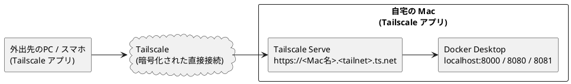
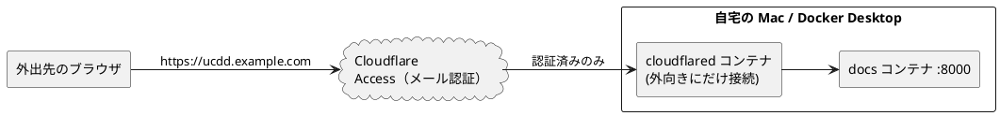

# 外出先から自宅の Mac にアクセスする

自宅の Mac（Docker Desktop）で動いているワークベンチを、外出先のノート PC やスマートフォンから見るための手順です。

!!! danger "ルーターのポート開放はしない"
    ドキュメントサーバ・PlantUML・draw.io には**ログイン機能がありません**。
    ルーターでポートを開放（ポートフォワード）すると、URL を知った誰もが閲覧・操作でき、
    自宅の IP アドレスも公開されます。以下のどちらかの方法で、**認証を通った人だけ**が届く経路を作ってください。

## どちらを使うか

| | A. Tailscale（推奨） | B. Cloudflare Tunnel + Access |
|---|---|---|
| 仕組み | 自分の端末同士だけをつなぐプライベート VPN | Cloudflare 経由で公開し、手前でメール認証をかける |
| 見る側の端末 | Tailscale アプリを入れる必要あり | ブラウザだけでよい |
| 必要なもの | Tailscale アカウント（Google / GitHub 等でログイン） | Cloudflare アカウント**と、Cloudflare に登録した独自ドメイン** |
| 費用 | 個人利用は無料（6 ユーザーまで、端末数無制限） | 無料枠あり（ドメイン代は別） |
| 向いている使い方 | 自分の PC・スマホから見る | チームの人やアプリを入れられない端末から見る |
| 手間 | 10 分程度 | 初回 30 分程度（ドメイン準備を除く。設定は `make cloudflare-setup` で自動化） |

自分で使うだけなら **A. Tailscale** を選んでください。

どちらの方法でも、自宅の Mac は**起動していて、スリープしていない**必要があります（[Mac をスリープさせない設定](#mac-をスリープさせない)）。

---

## A. Tailscale で接続する（推奨）



Tailscale Serve を使うと、自分の Tailscale ネットワーク（tailnet）に参加している端末だけが
`https://<Mac名>.<tailnet名>.ts.net` でワークベンチを開けます。インターネット全体には公開されません。

### A-1. 自宅の Mac に Tailscale を入れる

1. [Tailscale のダウンロードページ](https://tailscale.com/download/mac) から macOS 版をダウンロードしてインストールする。
   公式は App Store 版より **Standalone 版**を推奨しています。
2. メニューバーの Tailscale アイコン → **Log in** で、Google・Microsoft・GitHub などのアカウントでログインする。
3. 管理画面（[login.tailscale.com/admin/machines](https://login.tailscale.com/admin/machines)）に自宅の Mac が表示されることを確認する。
4. Mac の行の「…」メニュー → **Disable key expiry** を選ぶ。
   これをしないと、約 180 日ごとに再ログインが必要になり、外出中に突然つながらなくなります。

ターミナルで `tailscale` コマンドが見つからない場合は、次の行を `~/.zshrc` に追加してターミナルを開き直します
（ワークベンチの `make remote` はこの設定がなくても動きます）。

```bash
alias tailscale="/Applications/Tailscale.app/Contents/MacOS/Tailscale"
```

### A-2. ワークベンチを tailnet に公開する

ワークベンチを起動したうえで、リポジトリのフォルダで実行します。

```bash
cd ~/dev/use-case-driven-development-workbench
make up        # まだ起動していなければ
make remote    # ドキュメントサイトを公開
```

初回は「HTTPS 証明書を有効にしてよいか」を確認する URL が表示されます。ブラウザで開いて **Enable** を押し、もう一度 `make remote` を実行してください。

成功すると、次のような公開先が表示されます。

```
https://macbook.tail1234.ts.net (tailnet only)
|-- / proxy http://localhost:8000
```

PlantUML と draw.io も外から使いたい場合は `make remote-all` を使います。

| サービス | 外出先から開く URL |
|---|---|
| ドキュメント | `https://<Mac名>.<tailnet名>.ts.net/` |
| PlantUML | `https://<Mac名>.<tailnet名>.ts.net:8443/` |
| draw.io | `https://<Mac名>.<tailnet名>.ts.net:10000/` |

この設定は Mac を再起動しても残ります。止めるときは `make remote-off` を実行します。

### A-3. 外出先の端末から開く

1. 外出先で使う PC・iPhone・Android に Tailscale アプリを入れ、**自宅の Mac と同じアカウント**でログインする。
2. アプリで接続がオン（Connected）になっていることを確認する。
3. ブラウザで、A-2 で表示された `https://…ts.net` の URL を開く。

ドキュメントの図は自宅の Mac 側で描画されてページに埋め込まれるため、外出先からはドキュメントの URL だけで図まで表示されます。

### A-4. 家族・チームの人にも見せる場合

- 管理画面の **Users → Invite users** で招待すると、相手も同じ tailnet に参加できます（無料プランは 6 ユーザーまで）。
- 招待した人に自分の他の端末まで見せたくない場合は、**Access controls** で「Mac のポート 443 だけ」に絞るか、
  Mac だけを相手と共有する **Share**（Machines → … → Share）を使います。

---

## B. Cloudflare Tunnel + Access で接続する

Tailscale アプリを入れられない端末から見たい場合や、チームの人にブラウザだけで見せたい場合の方法です。
**Cloudflare に登録済みの独自ドメイン**（例: `example.com`）が必要です。



cloudflared は自宅から Cloudflare へ**外向き**に接続するため、ルーターの設定変更やポート開放は不要です。

### B-1. ドメインと Zero Trust を用意する（初回のみ・画面操作）

1. [Cloudflare](https://dash.cloudflare.com/sign-up) のアカウントを作る。
2. ドメインを用意する。
    - 持っていない場合: ダッシュボードの **Domain Registration → Register Domains** で購入する（.com は年 $10 程度）。購入したドメインは自動で Cloudflare に登録されます。
    - 他社で取得済みの場合: **Add a domain** で追加し、表示される 2 つのネームサーバーを取得元の管理画面で設定する（反映まで数時間かかることがあります）。
3. ダッシュボードの **Zero Trust** を開き、チーム名を決めて **Free プラン**を選ぶ（0 ドルですが、支払い方法の登録を求められる場合があります）。

### B-2. API トークンを作る（初回のみ）

自動設定スクリプトが Cloudflare を操作するための鍵を作ります。

1. [API Tokens](https://dash.cloudflare.com/profile/api-tokens) → **Create Token** → **Custom token** の **Get started** を選ぶ。
2. 名前を `ucdd-setup` とし、**Permissions** を次の 5 行にする。

    | 種類 | 項目 | 権限 |
    |---|---|---|
    | Account | Cloudflare Tunnel | Edit |
    | Account | Access: Apps and Policies | Edit |
    | Account | Access: Organizations, Identity Providers, and Groups | Edit |
    | Zone | DNS | Edit |
    | Zone | Zone | Read |

3. **Account Resources** は自分のアカウント、**Zone Resources** は **Specific zone** で使うドメインだけにする。
4. **TTL** に 1 日後の日付を入れておくと、使い終わったトークンが自動で無効になり安全です。
5. **Continue to summary → Create Token** を押し、表示されたトークンをコピーする（この画面でしか表示されません）。

### B-3. 自動設定を実行する

Docker Desktop を起動した状態で、リポジトリのフォルダで実行します。

```bash
cd ~/dev/use-case-driven-development-workbench
make cloudflare-setup
```

順に聞かれるので入力します。

```
Cloudflare API トークン（入力は表示されません）: （B-2 でコピーしたトークンを貼り付けて Enter）
Cloudflare に登録済みのドメイン（例: example.com）: example.com
公開に使うサブドメイン [ucdd]: （そのまま Enter）
閲覧を許可するメールアドレス（カンマ区切り）: me@example.org
```

スクリプトは次の順で設定し、最後に `.env` へトンネルのトークンを保存します。
**認証（Access）を先に作ってから**トンネルと DNS を作るので、認証なしで公開される時間はありません。

```
[1/5] ドメインを確認
[2/5] Access（認証）を設定   … One-time PIN ログイン・許可メールのポリシー・アプリ
[3/5] トンネルを用意         … home-mac-ucdd、ucdd.example.com → docs コンテナ
[4/5] DNS を設定             … ucdd.example.com → トンネル
[5/5] .env にトンネルのトークンを保存
```

- 何度実行しても同じ結果になります。許可するメールアドレスを変えたいときは、もう一度実行して入力し直します。
- 実際には変更せず、何をするかだけ確認したい場合は `make cloudflare-setup ARGS=--dry-run` を使います。
- API トークンはどこにも保存されません。終わったら API Tokens 画面で削除してかまいません（次回変更するときに作り直します）。

### B-4. トンネルを起動して開く

```bash
make tunnel
docker compose logs -f cloudflared   # "Registered tunnel connection" が出れば接続完了（Ctrl+C で抜ける）
```

1. 外出先のブラウザで `https://ucdd.example.com`（自分のドメイン）を開く。
2. メールアドレスを入力し、届いた 6 桁のコードを入力する。
3. ワークベンチが表示される。

許可していないメールアドレスにはコードが届かず、ページは表示されません。止めるときは `make down`（トンネルも止まります）。

### B-5. やめるとき

Cloudflare に作った設定（トンネル・DNS・Access）をすべて削除します。

```bash
make down
make cloudflare-setup ARGS=--delete
```

??? note "スクリプトを使わず画面で設定する場合"
    1. **Zero Trust → Settings → Authentication** で **One-time PIN** を追加する。
    2. **Access → Applications → Add an application → Self-hosted** で、ホスト名 `ucdd.example.com`、
       Policy は Action **Allow**・Include **Emails** に許可するメールアドレスを設定する。**必ずトンネルより先に作る。**
    3. **Networks → Tunnels → Create a tunnel**（Cloudflared）で `home-mac-ucdd` を作り、Docker 用コマンドの
       `--token` の後ろの文字列（`eyJ`…）だけをコピーする（コマンドは実行しない）。
    4. 同じ画面の Public hostname で `ucdd.example.com` → Service **HTTP** / **`docs:8000`** を設定する
       （`localhost:8000` ではない点に注意）。
    5. `.env` に `CLOUDFLARE_TUNNEL_TOKEN=eyJ…` を書き、`make tunnel` を実行する。

!!! warning "トークンの扱い"
    トンネルのトークンは、自分のドメインにサーバをつなぐための鍵です。チャットやリポジトリに貼らないでください。
    漏れた場合は `make cloudflare-setup ARGS=--delete` で削除してから、もう一度 `make cloudflare-setup` を実行します。

---

## Mac をスリープさせない

外出中に自宅の Mac がスリープすると、どちらの方法でもつながらなくなります。

1. **システム設定 → バッテリー → オプション** を開く。
2. **「電源アダプタ接続時、ディスプレイがオフのときに自動でスリープさせない」** をオンにする。
3. **「ネットワークアクセスによるスリープ解除」** を「電源アダプタ接続時のみ」以上にする。
4. MacBook は**ふたを閉じるとスリープ**します。ふたを開けたままにするか、外部ディスプレイ・電源・キーボードをつないだクラムシェル状態で使います。
5. Docker Desktop の **Settings → General → Start Docker Desktop when you sign in** をオンにし、
   **システム設定 → ユーザとグループ** で自動ログインを有効にしておくと、停電や再起動の後も自動で復帰します。

一時的にスリープを止めたいだけなら、ターミナルで次を実行している間はスリープしません（電源接続時）。

```bash
caffeinate -s
```

## 安全に使うためのチェックリスト

- [ ] ルーターでポート開放をしていない
- [ ] `.env` の `BIND_ADDRESS` が `127.0.0.1` のまま（`0.0.0.0` にすると同じ Wi-Fi の他人からも見える）
- [ ] Tailscale を使う場合、知らない端末が管理画面の Machines に並んでいない
- [ ] Cloudflare を使う場合、Access のポリシーが「特定のメールアドレスのみ Allow」になっている
- [ ] 使わない期間は `make remote-off` / `make down` で公開を止める
- [ ] macOS・Docker Desktop・Tailscale を最新に保つ

## うまくいかないとき

| 症状 | 対処 |
|---|---|
| `make remote` で `tailscale: No such file or directory` | Tailscale アプリが入っていない、または `/Applications` 以外に置いている。A-1 をやり直す |
| ts.net の URL を開くと「サイトにアクセスできません」 | 見る側の端末で Tailscale がオフになっている。アプリで Connected にする |
| ts.net の URL がタイムアウトする | 自宅の Mac がスリープ中か、Docker が止まっている。帰宅後に設定を見直す |
| `make remote` で HTTPS を有効にするよう求められ続ける | 表示された URL を開いて Enable したか確認。管理画面 **DNS** で MagicDNS と HTTPS Certificates がオンか確認 |
| `make cloudflare-setup` で `Authentication error` | API トークンの権限が足りない。B-2 の 5 行がすべて入っているか、Zone Resources に対象ドメインが含まれているか確認 |
| `make cloudflare-setup` で「Zero Trust の初期設定が済んでいない」 | B-1 の 3 を行う |
| `make cloudflare-setup` で「既に使われています」 | そのサブドメインに別の DNS レコードがある。別のサブドメインを入力するか、置き換えてよければ `ARGS=--force` |
| Cloudflare で `502 Bad Gateway` | Service URL が `docs:8000` になっているか、`make tunnel` で docs も起動しているかを確認 |
| Cloudflare のログイン画面が出ずにそのまま表示される | 認証がかかっていない。すぐに `make down` し、`make cloudflare-setup` を再実行する |
| ページは出るが保存しても自動更新されない | 自動更新は WebSocket を使う。ブラウザを再読み込みすれば最新が表示される |
