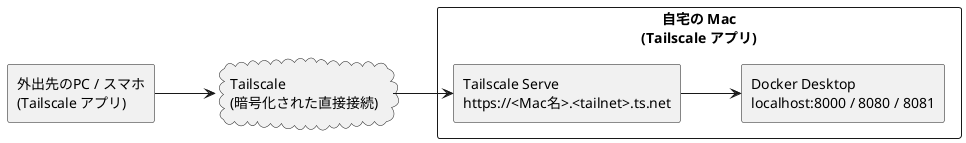
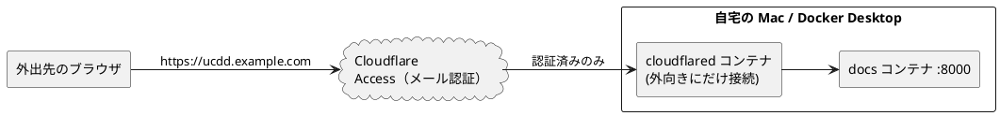

# 外出先から自宅の Mac にアクセスする

自宅の Mac（Docker Desktop）で動いているワークベンチを、外出先のノート PC やスマートフォンから見るための手順です。

!!! danger "ルーターのポート開放はしない"
    ドキュメントサーバ・PlantUML・draw.io には**ログイン機能がありません**。
    ルーターでポートを開放（ポートフォワード）すると、URL を知った誰もが閲覧・操作でき、
    自宅の IP アドレスも公開されます。以下のどちらかの方法で、**認証を通った人だけ**が届く経路を作ってください。

## どちらを使うか

| | A. Tailscale（推奨） | B. Cloudflare Tunnel + Access |
|---|---|---|
| 仕組み | 自分の端末同士だけをつなぐプライベート VPN | Cloudflare 経由で公開し、手前でメール認証をかける |
| 見る側の端末 | Tailscale アプリを入れる必要あり | ブラウザだけでよい |
| 必要なもの | Tailscale アカウント（Google / GitHub 等でログイン） | Cloudflare アカウント**と、Cloudflare に登録した独自ドメイン** |
| 費用 | 個人利用は無料（6 ユーザーまで、端末数無制限） | 無料枠あり（ドメイン代は別） |
| 向いている使い方 | 自分の PC・スマホから見る | チームの人やアプリを入れられない端末から見る |
| 手間 | 10 分程度 | 30 分程度 |

自分で使うだけなら **A. Tailscale** を選んでください。

どちらの方法でも、自宅の Mac は**起動していて、スリープしていない**必要があります（[Mac をスリープさせない設定](#mac-をスリープさせない)）。

---

## A. Tailscale で接続する（推奨）



Tailscale Serve を使うと、自分の Tailscale ネットワーク（tailnet）に参加している端末だけが
`https://<Mac名>.<tailnet名>.ts.net` でワークベンチを開けます。インターネット全体には公開されません。

### A-1. 自宅の Mac に Tailscale を入れる

1. [Tailscale のダウンロードページ](https://tailscale.com/download/mac) から macOS 版をダウンロードしてインストールする。
   公式は App Store 版より **Standalone 版**を推奨しています。
2. メニューバーの Tailscale アイコン → **Log in** で、Google・Microsoft・GitHub などのアカウントでログインする。
3. 管理画面（[login.tailscale.com/admin/machines](https://login.tailscale.com/admin/machines)）に自宅の Mac が表示されることを確認する。
4. Mac の行の「…」メニュー → **Disable key expiry** を選ぶ。
   これをしないと、約 180 日ごとに再ログインが必要になり、外出中に突然つながらなくなります。

ターミナルで `tailscale` コマンドが見つからない場合は、次の行を `~/.zshrc` に追加してターミナルを開き直します
（ワークベンチの `make remote` はこの設定がなくても動きます）。

```bash
alias tailscale="/Applications/Tailscale.app/Contents/MacOS/Tailscale"
```

### A-2. ワークベンチを tailnet に公開する

ワークベンチを起動したうえで、リポジトリのフォルダで実行します。

```bash
cd ~/dev/use-case-driven-development-workbench
make up        # まだ起動していなければ
make remote    # ドキュメントサイトを公開
```

初回は「HTTPS 証明書を有効にしてよいか」を確認する URL が表示されます。ブラウザで開いて **Enable** を押し、もう一度 `make remote` を実行してください。

成功すると、次のような公開先が表示されます。

```
https://macbook.tail1234.ts.net (tailnet only)
|-- / proxy http://localhost:8000
```

PlantUML と draw.io も外から使いたい場合は `make remote-all` を使います。

| サービス | 外出先から開く URL |
|---|---|
| ドキュメント | `https://<Mac名>.<tailnet名>.ts.net/` |
| PlantUML | `https://<Mac名>.<tailnet名>.ts.net:8443/` |
| draw.io | `https://<Mac名>.<tailnet名>.ts.net:10000/` |

この設定は Mac を再起動しても残ります。止めるときは `make remote-off` を実行します。

### A-3. 外出先の端末から開く

1. 外出先で使う PC・iPhone・Android に Tailscale アプリを入れ、**自宅の Mac と同じアカウント**でログインする。
2. アプリで接続がオン（Connected）になっていることを確認する。
3. ブラウザで、A-2 で表示された `https://…ts.net` の URL を開く。

ドキュメントの図は自宅の Mac 側で描画されてページに埋め込まれるため、外出先からはドキュメントの URL だけで図まで表示されます。

### A-4. 家族・チームの人にも見せる場合

- 管理画面の **Users → Invite users** で招待すると、相手も同じ tailnet に参加できます（無料プランは 6 ユーザーまで）。
- 招待した人に自分の他の端末まで見せたくない場合は、**Access controls** で「Mac のポート 443 だけ」に絞るか、
  Mac だけを相手と共有する **Share**（Machines → … → Share）を使います。

---

## B. Cloudflare Tunnel + Access で接続する

Tailscale アプリを入れられない端末から見たい場合や、チームの人にブラウザだけで見せたい場合の方法です。
**Cloudflare に登録済みの独自ドメイン**（例: `example.com`）が必要です。



cloudflared は自宅から Cloudflare へ**外向き**に接続するため、ルーターの設定変更やポート開放は不要です。

### B-1. 先にアクセス制限（Access）を作る

トンネルを公開する**前に**、認証を設定しておきます（逆の順序だと、設定するまでの間だれでも見られる状態になります）。

1. [Cloudflare ダッシュボード](https://dash.cloudflare.com/) で **Zero Trust** を開く（初回はチーム名の設定と、無料プランの選択を求められます）。
2. **Access → Applications → Add an application → Self-hosted** を選ぶ。
3. 次のように設定する。
    - Application name: `UCDD Workbench`
    - Public hostname: サブドメイン `ucdd`、ドメイン `example.com`（自分のドメイン）
    - Session duration: `24 hours` など
4. **Policy** を追加する。
    - Action: **Allow**
    - Include → **Emails**: 閲覧を許可する人のメールアドレス（自分のアドレスなど）
5. ログイン方法は **One-time PIN** を有効にする（メールに届く 6 桁のコードでログインする方式で、追加設定は不要です）。
6. 保存する。

### B-2. トンネルを作り、トークンを取得する

1. ダッシュボードの **Networks → Tunnels → Create a tunnel** を選ぶ（種類は **Cloudflared**）。
2. 名前を付ける（例: `home-mac-ucdd`）。
3. インストール方法で **Docker** を選ぶと、`docker run cloudflare/cloudflared:latest tunnel ... run --token eyJ...` というコマンドが表示されます。
   この `--token` の後ろの長い文字列（`eyJ` で始まる）だけをコピーします。**コマンドは実行しません**（ワークベンチの Compose で起動するため）。
4. 次の画面の **Public hostname（Published application）** で次のように設定する。
    - Subdomain: `ucdd`、Domain: `example.com`（B-1 と同じ）
    - Service: Type **HTTP**、URL **`docs:8000`**

    `localhost:8000` ではなく `docs:8000` と指定するのがポイントです（cloudflared は Compose の中から docs コンテナに直接つなぎます）。

### B-3. Mac でトンネルを起動する

リポジトリの `.env` にトークンを書きます（`.env` は Git の管理対象外なので、コミットされません）。

```bash
cd ~/dev/use-case-driven-development-workbench
open -e .env    # テキストエディットで開く
```

```dotenv
CLOUDFLARE_TUNNEL_TOKEN=eyJhIjoi...（コピーしたトークン）
```

保存したら起動します。

```bash
make tunnel
docker compose logs -f cloudflared   # "Registered tunnel connection" が出れば接続完了（Ctrl+C で抜ける）
```

### B-4. 外出先から開く

1. ブラウザで `https://ucdd.example.com` を開く。
2. Cloudflare のログイン画面でメールアドレスを入力し、届いたコードを入力する。
3. ワークベンチが表示される。

許可していないメールアドレスではコードが届かず、ページは表示されません。止めるときは `make down`（トンネルも止まります）。

!!! warning "トークンの扱い"
    トンネルのトークンは、自分のドメインにサーバをつなぐための鍵です。チャットやリポジトリに貼らないでください。
    漏れた場合は、ダッシュボードでトンネルを削除して作り直します。

---

## Mac をスリープさせない

外出中に自宅の Mac がスリープすると、どちらの方法でもつながらなくなります。

1. **システム設定 → バッテリー → オプション** を開く。
2. **「電源アダプタ接続時、ディスプレイがオフのときに自動でスリープさせない」** をオンにする。
3. **「ネットワークアクセスによるスリープ解除」** を「電源アダプタ接続時のみ」以上にする。
4. MacBook は**ふたを閉じるとスリープ**します。ふたを開けたままにするか、外部ディスプレイ・電源・キーボードをつないだクラムシェル状態で使います。
5. Docker Desktop の **Settings → General → Start Docker Desktop when you sign in** をオンにし、
   **システム設定 → ユーザとグループ** で自動ログインを有効にしておくと、停電や再起動の後も自動で復帰します。

一時的にスリープを止めたいだけなら、ターミナルで次を実行している間はスリープしません（電源接続時）。

```bash
caffeinate -s
```

## 安全に使うためのチェックリスト

- [ ] ルーターでポート開放をしていない
- [ ] `.env` の `BIND_ADDRESS` が `127.0.0.1` のまま（`0.0.0.0` にすると同じ Wi-Fi の他人からも見える）
- [ ] Tailscale を使う場合、知らない端末が管理画面の Machines に並んでいない
- [ ] Cloudflare を使う場合、Access のポリシーが「特定のメールアドレスのみ Allow」になっている
- [ ] 使わない期間は `make remote-off` / `make down` で公開を止める
- [ ] macOS・Docker Desktop・Tailscale を最新に保つ

## うまくいかないとき

| 症状 | 対処 |
|---|---|
| `make remote` で `tailscale: No such file or directory` | Tailscale アプリが入っていない、または `/Applications` 以外に置いている。A-1 をやり直す |
| ts.net の URL を開くと「サイトにアクセスできません」 | 見る側の端末で Tailscale がオフになっている。アプリで Connected にする |
| ts.net の URL がタイムアウトする | 自宅の Mac がスリープ中か、Docker が止まっている。帰宅後に設定を見直す |
| `make remote` で HTTPS を有効にするよう求められ続ける | 表示された URL を開いて Enable したか確認。管理画面 **DNS** で MagicDNS と HTTPS Certificates がオンか確認 |
| Cloudflare で `502 Bad Gateway` | Service URL が `docs:8000` になっているか、`make tunnel` で docs も起動しているかを確認 |
| Cloudflare のログイン画面が出ずにそのまま表示される | Access アプリのホスト名とトンネルのホスト名が一致していない。B-1 を見直す（危険なので先に `make down`） |
| ページは出るが保存しても自動更新されない | 自動更新は WebSocket を使う。ブラウザを再読み込みすれば最新が表示される |
