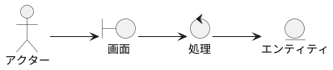
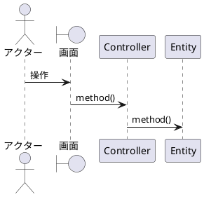

# UC-XXX （ユースケース名）

このファイルをコピーして `docs/usecases/UC-XXX-英語名.md` として保存し、`mkdocs.yml` の nav に追加してください。

**主アクター**:　**事前条件**:　**事後条件**:

## 基本コース
1. （アクター）は「（画面名）」で〜する。
2. システムは **（ドメインオブジェクト）** を〜する。
3. システムは「（画面名）」に〜を表示する。

## 代替コース
- **2a. （条件）**: システムは〜する。

## ロバストネス図

## シーケンス図

