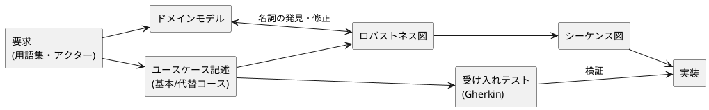

# ユースケース駆動開発 リポジトリ

このサイトは `docs/` 配下の Markdown から自動生成されています。図はすべて PlantUML のテキストで書かれ、Git で差分管理できます。

## 成果物の流れ



## 使い方

| やること | 場所 |
|---|---|
| 新しいユースケースを書く | `docs/guide/usecase-template.md` をコピーして `docs/usecases/UC-xxx-*.md` を作成 |
| 図を描く | Markdown 内に ` ```plantuml ` ブロックで記述（保存すると即反映） |
| 図をGUIで試し描き | [draw.io](http://localhost:8081) / [PlantUML Server](http://localhost:8080) |
| 受け入れテスト | `tests/acceptance/UC-xxx.feature` |
| 整合性チェック | `make check`（ID重複・必須項目・テスト対応を検査） |
