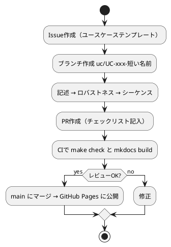

# 開発プロセス

ICONIX プロセスをベースにした、ユースケース駆動の進め方です。各ステップの完了条件を満たしたら Pull Request でレビューします。

## 1. 要求の整理
- `requirements/glossary.md` に用語を、`requirements/actors.md` にアクターを登録する。
- **完了条件**: ユースケース記述に登場する名詞がすべて用語集にある。

## 2. ドメインモデル（初版）
- 用語集の名詞からクラス候補を抽出し、`domain/domain-model.md` にクラス図で描く。属性・操作はまだ書かなくてよい。

## 3. ユースケース記述
- テンプレートから作成し、**基本コース**と**代替コース**を能動態・現在形で書く（「システムは〜を表示する」）。
- 画面名・ドメインオブジェクト名を明記する（後のロバストネス分析の入力になる）。
- **完了条件**: GitHub Issue（ユースケーステンプレート）と紐づいている。

## 4. ロバストネス分析
- ユースケース記述の文を 1 文ずつ、バウンダリ／コントロール／エンティティに割り当てる。
- ルール: アクター↔バウンダリ、バウンダリ↔コントロール、コントロール↔エンティティ、コントロール↔コントロールのみ接続可。
- 新しく見つかった名詞はドメインモデルへ反映し、記述の曖昧な点は記述側を直す。
- **完了条件**: 記述のすべての文が図に対応している（Preliminary Design Review）。

## 5. シーケンス図
- ロバストネス図のコントロールを、どのクラスのメソッドに割り当てるか決める。
- **完了条件**: ドメインモデルに操作が反映されている（Critical Design Review）。

## 6. 受け入れテスト・実装
- 基本コース・代替コースそれぞれを Gherkin シナリオに落とす（`tests/acceptance/`）。
- 実装 PR には対応する UC ID を書く（例: `Refs UC-002`）。

## Git 運用

