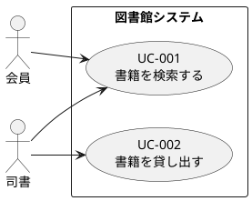

# アクター

```plantuml
@startuml
left to right direction
actor 会員 as Member
actor 司書 as Librarian
rectangle 図書館システム {
  usecase "UC-001\n書籍を検索する" as UC1
  usecase "UC-002\n書籍を貸し出す" as UC2
}
Member --> UC1
Librarian --> UC1
Librarian --> UC2
@enduml
```

| アクター | 説明 | 関わるユースケース |
|---|---|---|
| 会員 | 書籍を探し、借りる人 | UC-001 |
| 司書 | カウンターで貸出処理をする職員 | UC-001, UC-002 |
