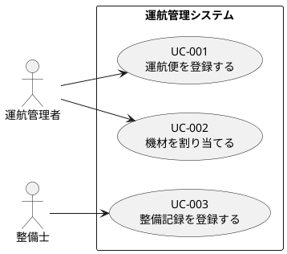

# アクター

```plantuml
@startuml
left to right direction
actor 運航管理者 as Dispatcher
actor 整備士 as Mechanic
rectangle 運航管理システム {
  usecase "UC-001\n運航便を登録する" as UC1
  usecase "UC-002\n機材を割り当てる" as UC2
  usecase "UC-003\n整備記録を登録する" as UC3
}
Dispatcher --> UC1
Dispatcher --> UC2
Mechanic --> UC3
@enduml
```

| アクター | 説明 | 関わるユースケース |
|---|---|---|
| 運航管理者 | 運航便を計画し、機材を割り当てる職員 | UC-001, UC-002 |
| 整備士 | 機材を整備し、整備記録・整備予定を登録する職員 | UC-003 |
