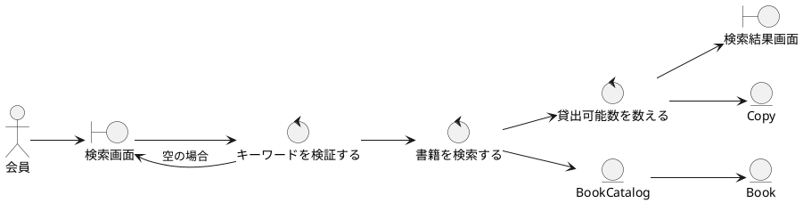
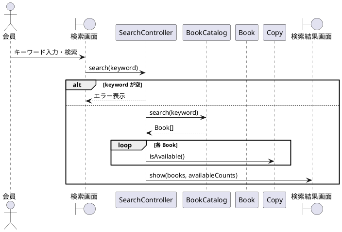

# UC-001 書籍を検索する

**主アクター**: 会員　**事前条件**: なし　**事後条件**: 検索結果が表示されている

## 基本コース
1. 会員は「検索画面」でキーワードを入力し、検索ボタンを押す。
2. システムはキーワードで **書籍** を検索する。
3. システムは該当した書籍の一覧と、各書籍の貸出可能な **蔵書** 数を「検索結果画面」に表示する。

## 代替コース
- **2a. キーワードが空**: システムは「検索画面」に「キーワードを入力してください」と表示する。
- **3a. 該当なし**: システムは「検索結果画面」に「該当する書籍はありません」と表示する。

## ロバストネス図

## シーケンス図

