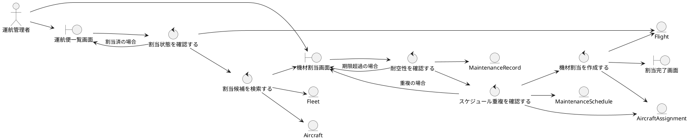
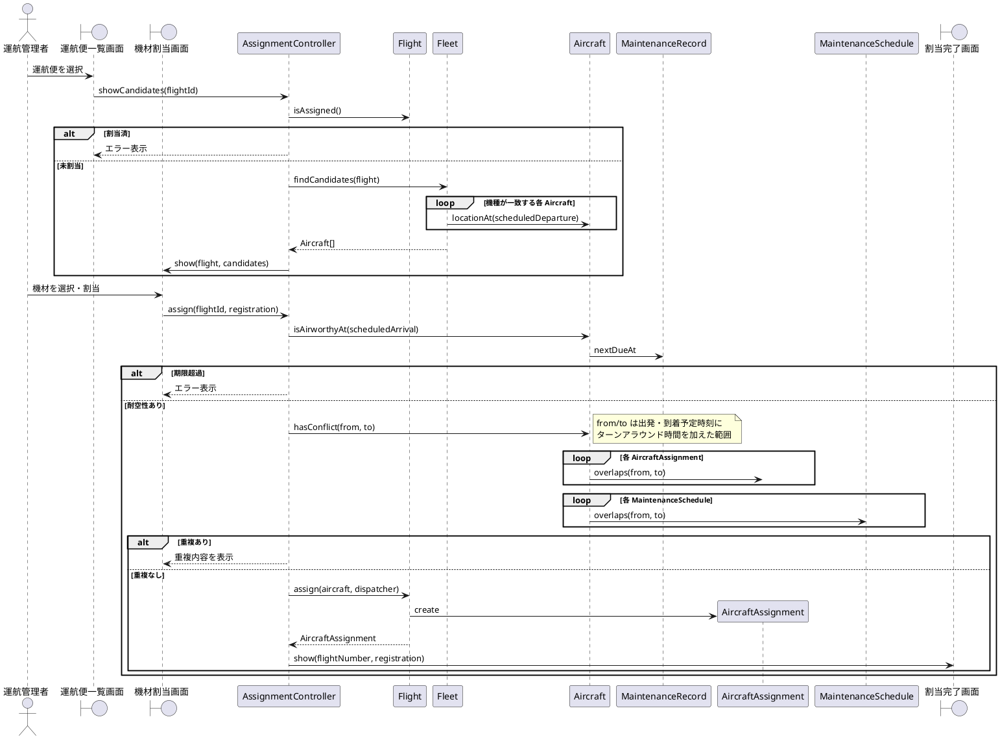

# UC-002 機材を割り当てる

**主アクター**: 運航管理者　**事前条件**: 運航管理者がログインしており、機材未割当の **運航便** が登録されている（UC-001）
**事後条件**: **機材割当** が記録され、**運航便** が機材割当済になる

## 基本コース
1. 運航管理者は「運航便一覧画面」で機材未割当の **運航便** を選択する。
2. システムは **機材群** から割当候補の **機材** を検索する。候補は、運航便の使用 **機種** と一致し、出発予定時刻の時点で出発 **空港** に駐機している機材とする。
3. システムは「機材割当画面」に運航便の内容と候補の機材を表示する。
4. 運航管理者は「機材割当画面」で候補から **機材** を選び、割当ボタンを押す。
5. システムは機材の **耐空性** を確認する（直近の **整備記録** の次回整備期限が到着予定時刻より後であること）。
6. システムは運航便の出発予定時刻から到着予定時刻まで（前後に **ターンアラウンド時間** を加える）に、機材の他の **機材割当** や **整備予定** が重ならないことを確認する。
7. システムは **機材割当** を作成し、**運航便** を機材割当済にする。
8. システムは「割当完了画面」に便名と機体登録記号を表示する。

## 代替コース
- **1a. 運航便がすでに機材割当済**: システムは「運航便一覧画面」に「この運航便は機材割当済です」と表示する。
- **2a. 割当候補がない**: システムは「機材割当画面」に「割当可能な機材がありません」と表示する。運航管理者はこのユースケースを終了する。
- **5a. 次回整備期限が到着予定時刻以前**: システムは「機材割当画面」に「整備期限を超過するため割り当てられません」と表示し、ステップ 4 に戻る。
- **6a. 他の機材割当または整備予定と重なる**: システムは「機材割当画面」に重なっている便名または整備予定期間を表示し、ステップ 4 に戻る。

## ロバストネス図

## シーケンス図

ロバストネス図のコントロールは次のように操作へ割り当てました。

| コントロール | 操作 |
|---|---|
| 割当状態を確認する | `Flight.isAssigned()` |
| 割当候補を検索する | `Fleet.findCandidates(flight)`（内部で `Aircraft.locationAt(time)`） |
| 耐空性を確認する | `Aircraft.isAirworthyAt(time)` |
| スケジュール重複を確認する | `Aircraft.hasConflict(from, to)`（内部で `AircraftAssignment.overlaps` / `MaintenanceSchedule.overlaps`） |
| 機材割当を作成する | `Flight.assign(aircraft, dispatcher)` |

`AssignmentController` は画面からの要求を受けて上記の操作を順に呼び出すだけで、判定ロジックはエンティティに置きます。

