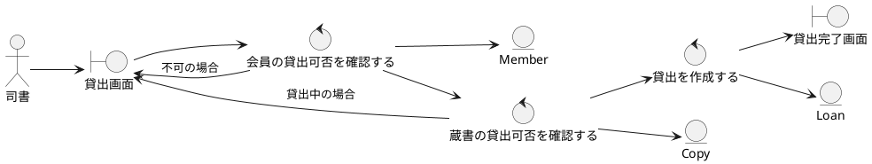

# UC-002 書籍を貸し出す

**主アクター**: 司書　**事前条件**: 司書がログインしている　**事後条件**: **貸出** が記録され、**蔵書** が貸出中になる

## 基本コース
1. 司書は「貸出画面」で **会員** ID と **蔵書** ID を入力し、貸出ボタンを押す。
2. システムは会員が貸出可能か（延滞がなく、上限冊数未満か）を確認する。
3. システムは蔵書が貸出可能かを確認する。
4. システムは返却期限を 14 日後として **貸出** を作成する。
5. システムは「貸出完了画面」に返却期限を表示する。

## 代替コース
- **2a. 会員が延滞中または上限到達**: システムは「貸出画面」に理由を表示し、処理を中止する。
- **3a. 蔵書が貸出中**: システムは「貸出画面」に「この蔵書は貸出中です」と表示する。

## ロバストネス図

## シーケンス図

!!! todo "未作成"
    次のステップでロバストネス図のコントロールをクラスの操作に割り当てる。
